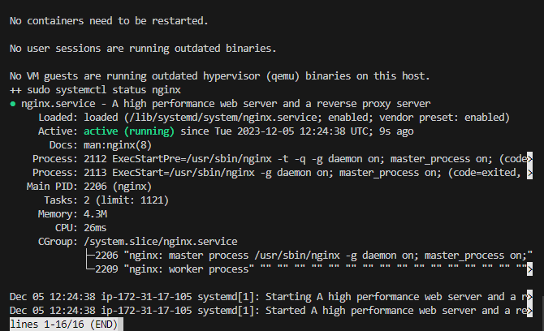
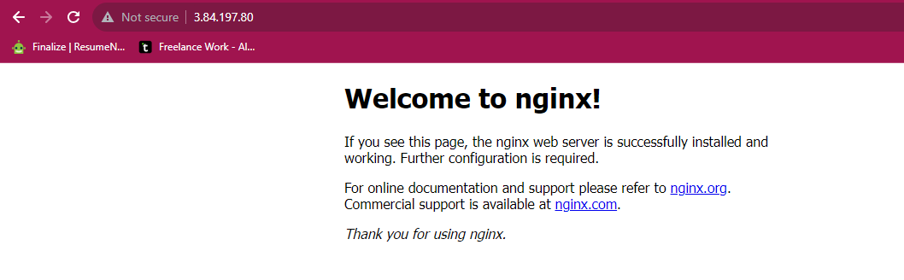

# Automating-loadbalancer-configuration-with-shell-scripting

# Error I encountered while doing this project

The script I ran on loadbalancer did not run complete (showing lines 1-16/16END) at the end of the terminal and when i veryfied  the setup on the browser thereby giving me the default Nginx page instead of the Welcome to my EC2 instance page.

# Solution

On running it the second time, When it got to that stage i pressed q 
