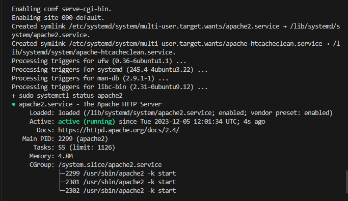

## Automating Loadbalancer configuratio with shell scripting

This is used to streamline the loadbalancer configuration with ease using shell scripting. So, this project demonstrates how to automate the setup and maintenance of the loadbalancer to enhance the efficiency and reduce manual efforts.

In this project, I deployed two bakend servers with a loadbalancer distributing traffic across the webservers. And also automate the entire process by running a shell script.

### Deploying and configuring the webservers

### Step 1

I provisioned two EC2 instances to serve as the two backend webservers running on Ubuntu 20.04. 

### Step 2

I opened port 8000 to allow traffic from anywhere using the security group in AWS console.

### Step 3

I connected to the both webservers via the terminal using the ssh.

webserver1

webserver2

### Step 4

I opened the install.sh file using `sudo vi install.sh` and pasted my script and closed the file using `:wq!`

#!/bin/bash

####################################################################################################################
##### This automates the installation and configuring of apache webserver to listen on port 8000
##### Usage: Call the script and pass in the Public_IP of your EC2 instance as the first argument as shown below:
######## ./install_configure_apache.sh 127.0.0.1
####################################################################################################################

set -x # debug mode
set -e # exit the script if there is an error
set -o pipefail # exit the script when there is a pipe failure

PUBLIC_IP=$1

[ -z "${PUBLIC_IP}" ] && echo "Please pass the public IP of your EC2 instance as an argument to the script" && exit 1

sudo apt update -y &&  sudo apt install apache2 -y

sudo systemctl status apache2

if [[ $? -eq 0 ]]; then
    sudo chmod 777 /etc/apache2/ports.conf
    echo "Listen 8000" >> /etc/apache2/ports.conf
    sudo chmod 777 -R /etc/apache2/

    sudo sed -i 's/<VirtualHost \*:80>/<VirtualHost *:8000>/' /etc/apache2/sites-available/000-default.conf

fi
sudo chmod 777 -R /var/www/
echo "<!DOCTYPE html>
        <html>
        <head>
            <title>My EC2 Instance</title>
        </head>
        <body>
            <h1>Welcome to my EC2 instance</h1>
            
Public IP: "${PUBLIC_IP}"

        </body>
        </html>" > /var/www/html/index.html

sudo systemctl restart apache2

webserver1

webserver2

### Step 5

I changed the permissions of the files on both servers to make them executable using the command `sudo chmod +x install.sh`

webserver1

webserver2

### Step 6

Then, I ran the script on both servers using the shell command `./install.sh 3.87.248.121` and  `./install.sh 54.87.144.222` (./install.sh pub_ip)

webserver1

webserver2

### Deploying and configuring Nginx load balancer

### Step 1

I provisioned an Ec2 instance to serve as a loadbalancer.

### Step 2

I edited the inbound rule of the server to run on port 80

### Step 3

I connected to the both webservers via the terminal using the ssh.

### Step 4

I opened the install.sh file using `sudo vi install.sh` and pasted my script and closed the file using `:wq!`

#!/bin/bash

######################################################################################################################
##### This automates the configuration of Nginx to act as a load balancer
##### Usage: The script is called with 3 command line arguments. The public IP of the EC2 instance where Nginx is installed
##### the webserver urls for which the load balancer distributes traffic. An example of how to call the script is shown below:
##### ./configure_nginx_loadbalancer.sh PUBLIC_IP Webserver-1 Webserver-2
#####  ./configure_nginx_loadbalancer.sh 127.0.0.1 192.2.4.6:8000  192.32.5.8:8000
############################################################################################################# 

PUBLIC_IP=$1
firstWebserver=$2
secondWebserver=$3

[ -z "${PUBLIC_IP}" ] && echo "Please pass the Public IP of your EC2 instance as the argument to the script" && exit 1

[ -z "${firstWebserver}" ] && echo "Please pass the Public IP together with its port number in this format: 127.0.0.1:8000 as the second argument to the script" && exit 1

[ -z "${secondWebserver}" ] && echo "Please pass the Public IP together with its port number in this format: 127.0.0.1:8000 as the third argument to the script" && exit 1

set -x # debug mode
set -e # exit the script if there is an error
set -o pipefail # exit the script when there is a pipe failure

sudo apt update -y && sudo apt install nginx -y
sudo systemctl status nginx

if [[ $? -eq 0 ]]; then
    sudo touch /etc/nginx/conf.d/loadbalancer.conf

    sudo chmod 777 /etc/nginx/conf.d/loadbalancer.conf
    sudo chmod 777 -R /etc/nginx/

    
    echo " upstream backend_servers {

            # your are to replace the public IP and Port to that of your webservers
            server  "${firstWebserver}"; # public IP and port for webserser 1
            server "${secondWebserver}"; # public IP and port for webserver 2

            }

           server {
            listen 80;
            server_name "${PUBLIC_IP}";

            location / {
                proxy_pass http://backend_servers;   
            }
    } " > /etc/nginx/conf.d/loadbalancer.conf
fi

sudo nginx -t

sudo systemctl restart nginx 

### Step 5

I changed the permissions of the files on both servers to make them executable using the command `sudo chmod +x nginx.sh`

### Step 6

Then, I ran the script on both servers using the shell command `./install.sh 3.80.197.80` (./install.sh pub_ip)

### Step 7

I finally ran the script with this command ` ./nginx.sh PUBLIC_IP Webserver-1 Webserver-2` 

### Verifying the setup on the brower

webserver1

webser2

load balancer

THANK YOU FOR REVIEWING!

